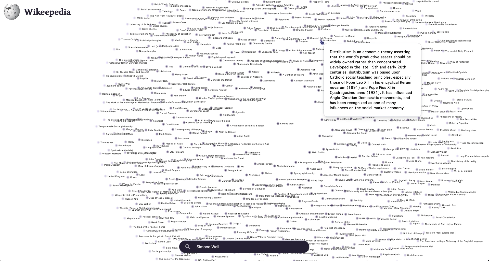

# Wikeepedia
A tool that turns Wikipedia pages into a graph, showing how articles link to each other. Useful to learn and browse related concepts visually.




## Quickstart
Wikeepedia is built on Flask. It's easy to launch, just follow the steps below.

1. **Clone the project**

````
git clone https://github.com/blankresearch/Wikeepedia
cd Wikeepedia

````
2. **Install requirements and launch**

```` 
python -m venv venv # Optional
source venv/bin/activate  # On Windows use: venv\Scripts\activate
pip install -r requirements.txt
python app.py
````
The app will start running locally, allowing you to access it via your browser at :  http://127.0.0.1:5000

## Features
Wikeepedia is designed for simplicity and ease of use. Key features include:

1. **Search Bar** – Enter a Wikipedia URL or keyword to explore.

2. **Zoom & Pan** – Scroll to zoom, drag to navigate the graph.

3. **Node Browsing** – Click a node to expand related articles.

4. **Open Wikipedia Page** – *Option + Left Click* opens the full article in a new tab.

5. **Summaries** – Hover over a node to view its article summary.

## Contributing
The project is currently on hold from future development, but fixes will be made.

## Connect

For feedback or contributions, reach out to me:

- [LinkedIn](https://www.linkedin.com/in/yousbot/)
- [GitHub](https://github.com/yousbot)
- [Blank Research page](https://blankresearch.com/)

Made with ❤️ by Youssef.

## Copyright
MIT License

Copyright (c) 2025 Blank Research, Inc.

Permission is hereby granted, free of charge, to any person obtaining a copy
of this software and associated documentation files (the "Software"), to deal
in the Software without restriction, including without limitation the rights
to use, copy, modify, merge, publish, distribute, sublicense, and/or sell    
copies of the Software, and to permit persons to whom the Software is         
furnished to do so, subject to the following conditions:                      

The above copyright notice and this permission notice shall be included in all
copies or substantial portions of the Software.                               

THE SOFTWARE IS PROVIDED "AS IS", WITHOUT WARRANTY OF ANY KIND, EXPRESS OR    
IMPLIED, INCLUDING BUT NOT LIMITED TO THE WARRANTIES OF MERCHANTABILITY,      
FITNESS FOR A PARTICULAR PURPOSE AND NONINFRINGEMENT. IN NO EVENT SHALL THE   
AUTHORS OR COPYRIGHT HOLDERS BE LIABLE FOR ANY CLAIM, DAMAGES OR OTHER        
LIABILITY, WHETHER IN AN ACTION OF CONTRACT, TORT OR OTHERWISE, ARISING FROM, 
OUT OF OR IN CONNECTION WITH THE SOFTWARE OR THE USE OR OTHER DEALINGS IN THE 
SOFTWARE.
